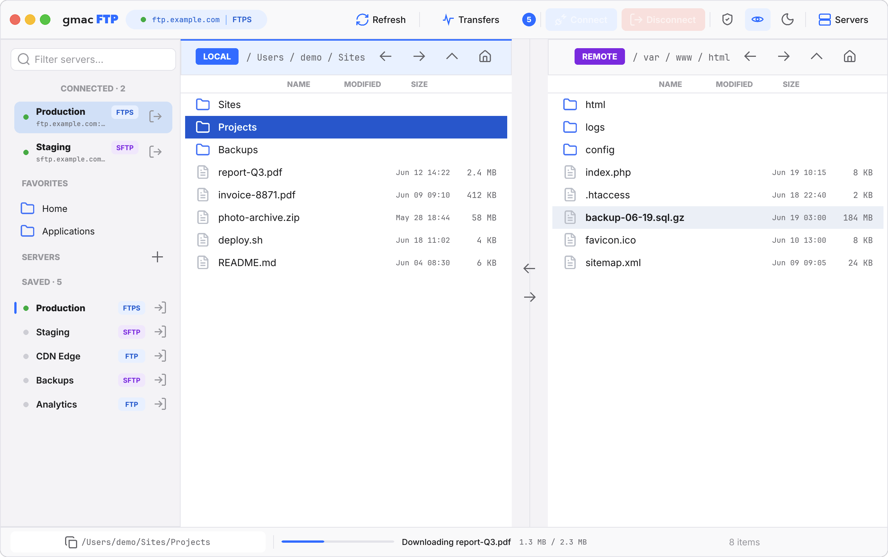
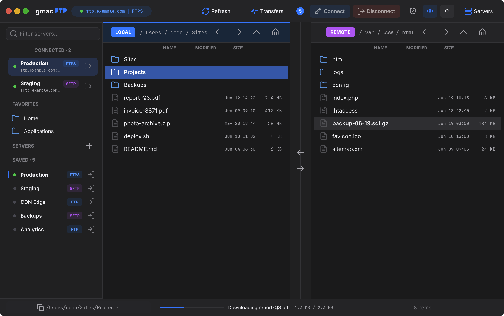
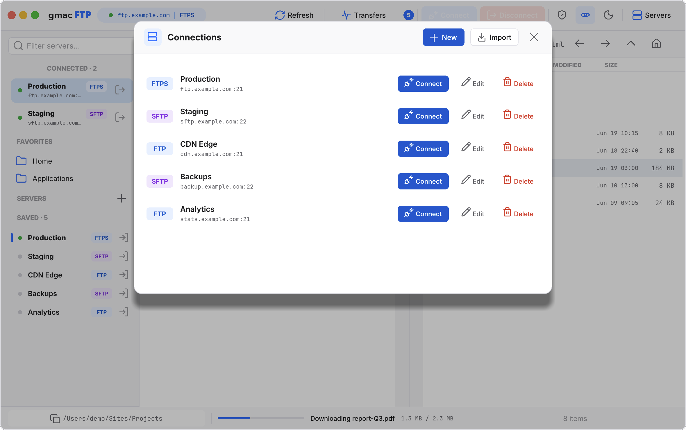
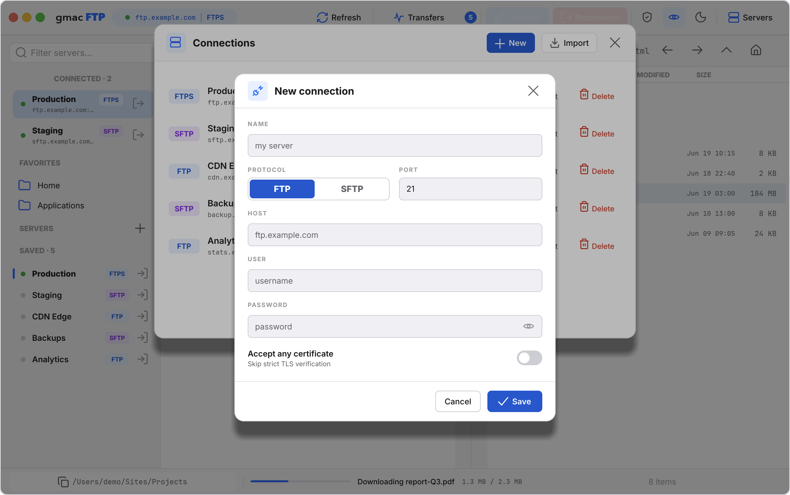
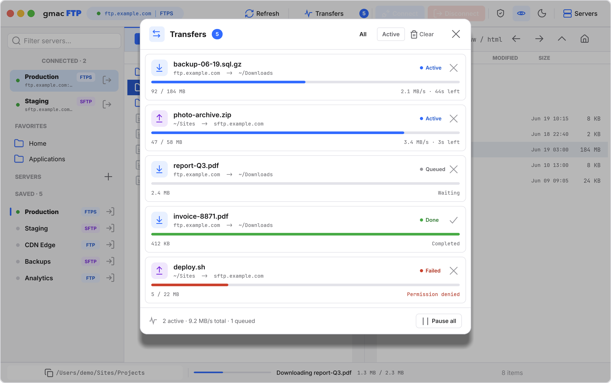

# gmacFTP

### The fast, secure, native FTP client for macOS.

Built in **Rust**. No Electron. No web view. No telemetry. Just a real macOS app that moves your
files — quickly and safely.

[](#)
[](#)
[](LICENSE)
[](#commercial-license)
[](#status)
[](https://buymeacoffee.com/gmac)



## ⬇️ Download & install

**[↓ Download gmacFTP for Mac — gmacFTP-0.0.11.dmg](https://github.com/GMAC-pl/gmacftp/releases/download/v0.0.11/gmacFTP-0.0.11.dmg)** · macOS 11+, Apple Silicon (M-series)

1. Download the `.dmg`.
2. Open it and **drag gmacFTP into the Applications folder** (a shortcut is inside).
3. Open gmacFTP from **Applications**. On the first Keychain prompt, click **Always Allow**.

Signed with an **Apple Developer ID** and **notarized by Apple** — opens cleanly with no warnings.

> 🧪 **Development preview (pre-1.0).** gmacFTP is early, but solid for everyday FTP / FTPS / SFTP
> work. Expect the occasional rough edge — feedback and bug reports are very welcome.

---

## English

### Why gmacFTP

- ⚡ **Fast.** Compiled Rust, not a wrapped browser. No runtime, no garbage collector, no Electron
  overhead — it cold-starts instantly and stays responsive under heavy transfers.
- 🔒 **Secure by design.** Passwords live in the macOS **Keychain** inside an AES-256-GCM vault;
  the master key never touches disk. FTPS is strict-by-default; SFTP verifies host keys.
- 🍎 **Genuinely native.** A real macOS app: custom titlebar, native menu bar, drag-and-drop,
  light/dark themes, Apple Silicon. Not a web page in disguise.
- ☁️ **Yours everywhere.** Optionally sync your saved servers across your Macs via iCloud —
  passwords travel only as AES-256 ciphertext, with the master key in your Keychain.
- 🔓 **Open & private.** GPL-3.0 licensed (with a commercial option). No accounts, no cloud dependency you didn't ask for, no
  telemetry. Your servers stay yours.

### Download

**[⬇ gmacFTP-0.0.11.dmg](https://github.com/GMAC-pl/gmacftp/releases/download/v0.0.11/gmacFTP-0.0.11.dmg)** — install steps are at the top of this page.

Prefer to build it yourself? See [Build](#build).

### Features

- **Dual-pane** browser — independent left/right panes (local, remote, or two servers at once)
- **FTP**, **explicit-TLS FTPS**, and **SFTP** (pure-Rust SSH stack)
- Upload / download / pane-to-pane transfers + a live **transfer queue**
- **macOS Keychain** secret storage (master key never on disk)
- Optional **iCloud sync** of saved servers across your Macs (toggle in the app menu)
- Connection manager, FileZilla `sitemanager.xml` + JSON import
- Native macOS **menu bar** (App / File / Edit / View / Window / Help) + About panel
- Light/dark themes, EN/PL UI

### Screenshots

|                                                  |                                                   |
| :----------------------------------------------: | :-----------------------------------------------: |
|         |            |
|                 Light workspace                  |                  Dark workspace                   |
|  |  |
|                Connection manager                |               New connection editor               |
|      |                                                   |
|                  Transfer queue                  |                                                   |

All screenshots use sample server names and placeholder credentials — never real data.

### Tech stack

- **Language:** Rust
- **UI:** Slint 1.x (`renderer-femtovg-wgpu` on macOS)
- **Runtime:** Tokio
- **FTP / FTPS:** `suppaftp` + native TLS
- **SFTP:** `russh` + `russh-sftp`
- **Secrets:** AES-256-GCM vault; master key in the macOS Keychain (not a plaintext file)
- **Persistence:** JSON metadata in the app config directory

See [`docs/ARCHITECTURE.md`](docs/ARCHITECTURE.md) for the layer breakdown.

### Build

Requirements: macOS 11+, Rust 1.88+, Xcode Command Line Tools.

```sh
cargo run --release
```

Build the native `.app` bundle:

```sh
bash scripts/build-app.sh
open target/release/gmacFTP-Public.app
```

Both panes start as your local filesystem, so you can try navigation, selection, sorting, the
connection manager, and local copy flows with no server at all.

### Privacy & security

- No telemetry, no accounts — the app only talks to the servers you configure. (iCloud sync is opt-in, off by default; only the master key uses the Keychain — server data syncs via iCloud's key-value store.)
- `data/`, `.env*`, build artifacts, and local tool state are gitignored; this repo contains no
  private data.
- Passwords are never stored in connection metadata.

More in [`docs/PRIVACY.md`](docs/PRIVACY.md) and [`SECURITY.md`](SECURITY.md).

### Status

gmacFTP is a **development preview (pre-1.0)**. Near-term: more automated UI coverage and hardened
import/migration.

### Support gmacFTP

gmacFTP is free and open source. If it saves you time, a coffee is greatly appreciated ☕

[](https://buymeacoffee.com/gmac)

### License

gmacFTP is dual-licensed:

- **GPL v3** — for personal use, open-source projects, and anyone who open-sources their own
  application. Free.
- **Commercial License** — for embedding gmacFTP into a closed-source / proprietary product without
  GPL obligations. Contact [GMAC](https://gmac.pl/kontakt/) for terms and pricing.

See [LICENSE](LICENSE) for the full GPL v3 text.

#### Commercial license

If you want to use gmacFTP (or parts of it) inside a product you do **not** open-source, the GPL v3
requires you to also release your code under GPL. To avoid that, you can purchase a commercial
license that lifts the copyleft obligation.

**[Contact GMAC →](https://gmac.pl/kontakt/)**

---

## Polski

### Szybki, bezpieczny, natywny klient FTP dla macOS.

Napisany w **Ruście**. Bez Electrona, bez web view, bez telemetrii. Prawdziwa aplikacja macOS,
która po prostu przenosi Twoje pliki — szybko i bezpiecznie.

> 🧪 **Wersja rozwojowa (pre-1.0).** gmacFTP jest wczesny, ale stabilny do codziennych transferów
> FTP / FTPS / SFTP. Licz się z drobnymi niedoskonałościami — feedback bardzo mile widziany.

### Dlaczego gmacFTP

- ⚡ **Szybki.** Skompilowany Rust, nie opakowana przeglądarka — bez runtime'u, bez GC, bez
  narzutu Electrona. Uruchamia się natychmiast i nie zacina przy dużych transferach.
- 🔒 **Bezpieczny.** Hasła w macOS **Keychain** w zaszyfrowanym vaultcie AES-256-GCM; klucz główny
  nigdy nie ląduje na dysku. FTPS strict-by-default; SFTP weryfikuje klucze hostów.
- 🍎 **Natywny.** Prawdziwa apka macOS: własny titlebar, natywne menu, drag-and-drop, jasny/ciemny
  motyw, Apple Silicon (v0.0.3: arm64).
- ☁️ **Twój wszędzie.** Opcjonalna synchronizacja zapisanych serwerów przez iCloud — hasła
  przesyłane są tylko jako zaszyfrowany szyfrogram (AES-256), a klucz mistrzowski zostaje w
  Keychainie.
- 🔓 **Otwarty i prywatny.** Licencja GPL-3.0 (z opcją komercyjną), bez kont, bez telemetrii.

### Pobranie i instalacja

**[⬇ Pobierz gmacFTP dla Maca — gmacFTP-0.0.11.dmg](https://github.com/GMAC-pl/gmacftp/releases/download/v0.0.11/gmacFTP-0.0.11.dmg)** · macOS 11+, Apple Silicon (M-series)

1. Pobierz plik `.dmg`.
2. Otwórz go i **przeciągnij gmacFTP do folderu Aplikacje** (skrót jest w środku).
3. Uruchom gmacFTP z **Aplikacji**. Przy pierwszym monicie Keychaina kliknij **Zawsze pozwalaj**.

Podpisana **Apple Developer ID** i **zanotaryzowana przez Apple** — uruchamia się czysto, bez ostrzeżeń.

### Funkcje

- **Dwupanelowa** przeglądarka — niezależne panele (lokalny, zdalny albo dwa serwery naraz)
- **FTP**, **FTPS** (explicit TLS) i **SFTP** (SSH w czystym Ruście)
- Transfery upload / download / panel-do-panelu + live **kolejka transferów**
- Sekrety w **macOS Keychain** (klucz główny nigdy na dysku)
- Opcjonalna **synchronizacja iCloud** zapisanych serwerów między Macami (przełącznik w menu)
- Menedżer połączeń, import z FileZilla `sitemanager.xml` + JSON
- Natywne **menu** macOS (App / File / Edit / View / Window / Help) + panel About
- Jasny/ciemny motyw, UI po ang. i pol.

### Zrzuty ekranu

|                                                  |                                                   |
| :----------------------------------------------: | :-----------------------------------------------: |
|         |            |
|               Jasny obszar roboczy               |               Ciemny obszar roboczy               |
|  |  |
|                Menedżer połączeń                 |             Edytor nowego połączenia              |
|      |                                                   |
|                Kolejka transferów                |                                                   |

Wszystkie zrzuty używają przykładowych nazw serwerów i zastępczych danych — nigdy realnych.

### Stos techniczny

- **Język:** Rust
- **UI:** Slint 1.x (`renderer-femtovg-wgpu` na macOS)
- **Runtime:** Tokio
- **FTP / FTPS:** `suppaftp` + native TLS
- **SFTP:** `russh` + `russh-sftp`
- **Sekrety:** vault AES-256-GCM; klucz główny w macOS Keychain (nie jako plik tekstowy)
- **Trwałość:** metadane JSON w katalogu konfiguracyjnym aplikacji

Patrz [`docs/ARCHITECTURE.md`](docs/ARCHITECTURE.md).

### Budowanie

Wymagania: macOS 11+, Rust 1.88+, Xcode Command Line Tools.

```sh
cargo run --release
# bundle .app:
bash scripts/build-app.sh
open target/release/gmacFTP-Public.app
```

Oba panele startują jako Twój lokalny filesystem, więc możesz wypróbować nawigację, zaznaczanie,
sortowanie, menedżer połączeń i lokalne kopiowanie bez żadnego serwera.

### Prywatność i bezpieczeństwo

- Brak telemetrii, brak kont — apka łączy się tylko z serwerami, które sam podałeś. (Synchronizacja iCloud jest opcjonalna, domyślnie wyłączona; w Keychainie jest tylko klucz mistrzowski — dane serwerów synchronizuje magazyn klucz-wartość iCloud.)
- `data/`, `.env*`, artefakty builda i stan narzędzi są gitignorowane; repo nie zawiera prywatnych danych.
- Hasła nigdy nie trafiają do metadanych połączeń.

Więcej: [`docs/PRIVACY.md`](docs/PRIVACY.md) oraz [`SECURITY.md`](SECURITY.md).

### Status

gmacFTP to **wersja rozwojowa (pre-1.0)**. W planach: więcej testów UI i utwardzenie importu/migracji.

### Wesprzyj gmacFTP

gmacFTP jest darmowy i open source. Jeśli oszczędza Ci czas — postaw mi kawę, bardzo dziękuję ☕

[](https://buymeacoffee.com/gmac)

### Licencja

gmacFTP jest na licencji podwójnej (dual-license):

- **GPL v3** — do użytku osobistego, projektów open-source i dla wszystkich, którzy udostępniają
  swój kod. Za darmo.
- **Licencja komercyjna** — dla osadzenia gmacFTP w produkcie zamkniętym / własnościowym bez
  zobowiązań GPL. Skontaktuj się z [GMAC](https://gmac.pl/kontakt/) w sprawie warunków i cen.

Pełny tekst GPL v3: [LICENSE](LICENSE).

#### Licencja komercyjna

Jeśli chcesz użyć gmacFTP (lub jego fragmentów) w produkcie, którego **nie** udostępniasz jako
open-source, licencja GPL v3 wymaga udostępnienia Twojego kodu pod GPL. Aby tego uniknąć, możesz
kupić licencję komercyjną, która znosi ten obowiązek.

**[Skontaktuj się z GMAC →](https://gmac.pl/kontakt/)**
